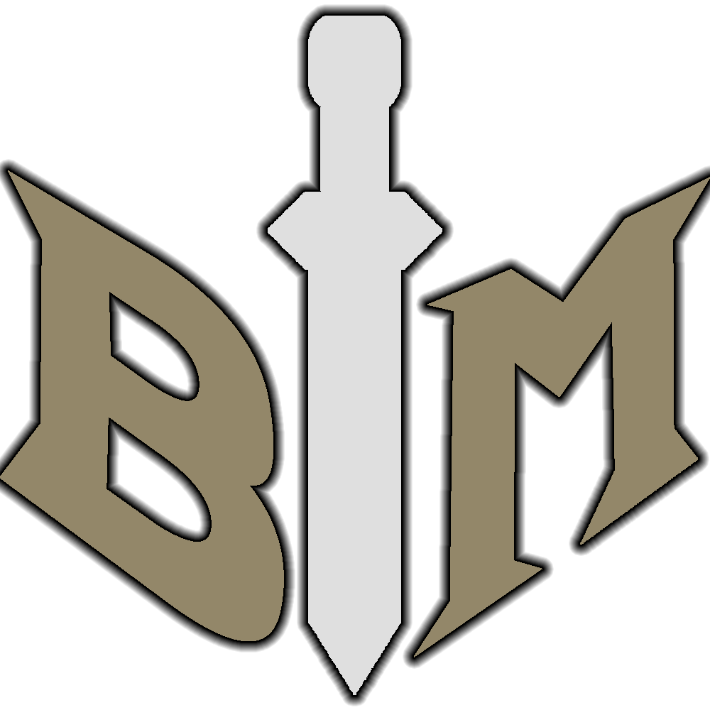

# BattleManager

### A Battle Tracker for DND

## Why?
Existing initiative trackers never feel good to use. They always feel less efficient than simple pen and paper. Technology is all about implementing speed and efficiency, so that is what I aim to bring. 

## Features
- [x] Initiative Re/Order
- [x] Health Tracking
- [x] AC Display
- [x] Saving Throw Display
- [x] Damage Wk/St
- [x] Create/Add Parties
- [x] Keyboard shortcuts to make things easy!
- [x] Battle Log
- [x] Custom Stat Blocks
- [ ] Existing Stat Blocks

## Download and install the  [dotnet 7 runtime](https://dotnet.microsoft.com/en-us/download/dotnet/thank-you/runtime-7.0.5-windows-x64-installer) if the program does not run

## Keyboard Shortcuts
- ### Ctrl
  - Select position in initiative based on number input

- ### Shift
  - Heal selected position based on number input

- ### Alt
  - Damage selected position based on number input

- ### Delete
  - Delete selected position

- ### Z
  - Undo last action

- ### Backspace
  - Clear number input to 0

- ### Up/Down Arrow
  - Change Selection

## Version Roadmap
### Version 0.1.0 - Battle Manager w/ Shortcuts
- [x] Initiative Order
- [x] Health Tracking
- [x] AC Display
- [x] Keyboard Shortcuts
- [x] Buttons

### Version 0.2.0 - Friends and Info
- [x] Create Party Set
- [x] ~~Export/Import Party Set~~ _This is implemented through sharing json files_
- [x] Add Party Set to tracker
- [x] Saving Throw Modifiers
- [x] Damage Resistances
- [x] Display Info

### Version 0.3.0 - Foe's
- [x] Custom Stat Blocks

### Version 0.4.0 - Existing Foe's
- [ ] Existing Stat Blocks

### Version 1.0.0
- [ ] Everything above
- [x] App Icon and cleaned up UI
